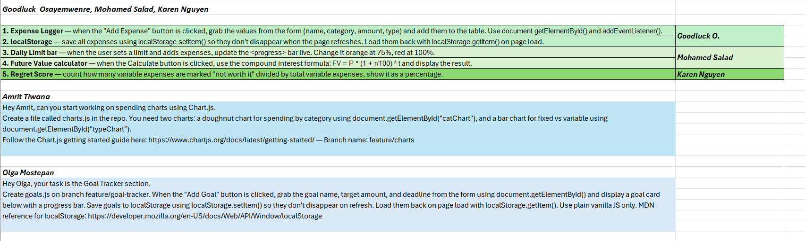
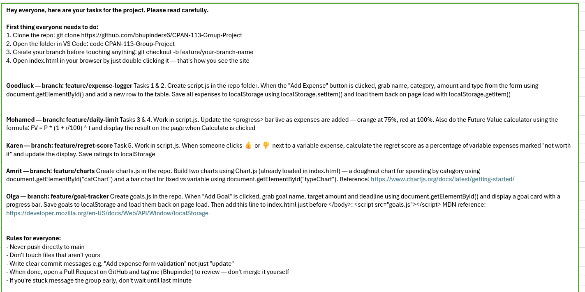

# CPAN-113-Group-Project
# Monetraq - Personal Finance Tracker 
A personal finance tracking tool build by CPAN 113 course team. THis is a smart and user-friendly finance management system designed to help students and young adults. 

# Features
- **Expense Logger** 
- **Future Value Display** 
- **Spending Chart** 
- **Goal Tracker** 
- **Regret Score** 
- **Daily Spending Limit** 

# Team Members:
- Bhupinder Singh
- Goodluck Osayemwenre
- Mohamed Salad
- Amrit Tiwana
- Olga Mostepan
- Karen Nguyen

# 🎯 Target Audience
Students and young adults who want to build better financial habits and understand the real cost of their spending.

#Links
- Live Site: https://bhupinders6.github.io/CPAN-113-Group-Project/
- Video

- 
# Tasks List in detail and each member responsibility explained

